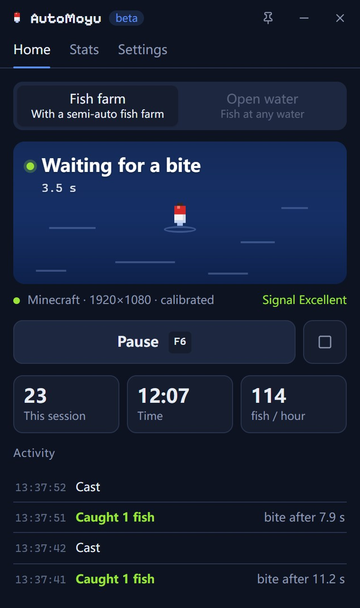
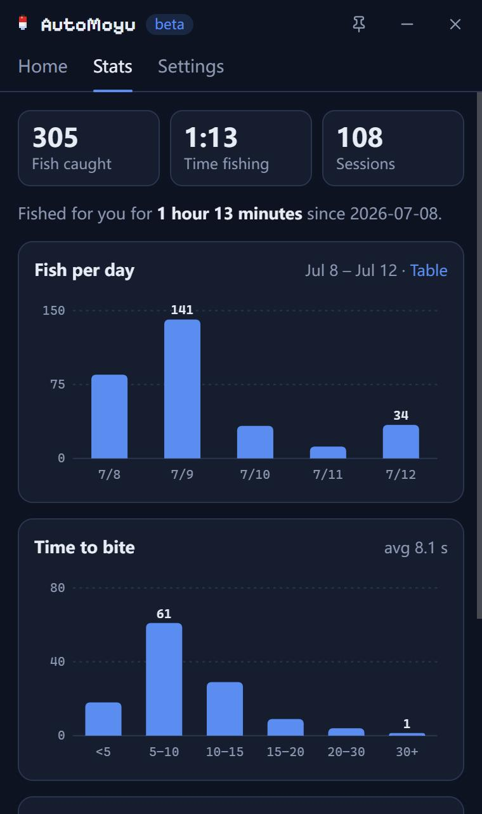

# AutoMoyu

[中文](README.md) | English

An auto-fishing tool for Minecraft Bedrock Edition on Windows. It watches the fishing rod in your hand and casts again whenever the rod comes back. No fish farm? It can fish fully on its own too.

  
  

## Features

- **Two modes**, both fully automatic; pick by where you fish
  - Fish farm: for use with a semi-automatic fish farm. The farm reels in, AutoMoyu casts again.
  - Open water: no farm needed. Face any water; AutoMoyu reels in when it hears a bite, then casts again.
- **No region picking, no thresholds to tune.** The first time you use it, AutoMoyu calibrates itself in about 10 seconds. Each window size only needs to be calibrated once.
- Recognises the rod by day, at night and in rain, and adjusts as the light changes at dusk and dawn.
- On laggy servers the cast often jumps back before going out again. AutoMoyu tells this apart from a real reel-in and doesn't cast twice.
- Steps aside when you move the mouse or press a key in game, and carries on 5 seconds after you stop.
- Stops and tells you why when a cast fails, the rod can't be recognised, or the game closes.
- Stats for fish per day and time to bite.
- Tray icon, in-game overlay, rebindable hotkeys (F6 start/pause and F7 overlay by default).
- Automatic updates. English and Chinese interface.

## Requirements

- Windows 10 version 2004 or later, 64-bit
- Minecraft Bedrock Edition from the Microsoft Store or the Xbox app
- The game in **windowed or borderless** mode (exclusive fullscreen can't be captured)

## Install

Download `AutoMoyu_<version>_x64-setup.exe` from [Releases](https://github.com/fineyh/AutoMoyu/releases) and run it. It installs for the current user and doesn't need admin rights. If WebView2 is missing, the installer downloads it (Windows 11 already has it).

The installer isn't code-signed yet, so SmartScreen may block it. Click **More info**, then **Run anyway**.

AutoMoyu checks for updates by itself. It won't interrupt you while fishing; once you stop, an update notice shows up on the Home screen.

## Usage

1. Start the game and hold a fishing rod. In fish farm mode, stand where the farm expects you. In open water mode, aim at the water.
2. AutoMoyu opens calibration on first launch. Switch to the game and press **F6**. It casts twice by itself; don't move the mouse until it's done.
3. Press **F6** to start fishing and again to pause. **F7** shows or hides the in-game overlay.

Keep the game window in front while it runs. Switching to another window pauses fishing, and switching back resumes it. If the window size changes, you'll be asked to calibrate again.

For steadier detection:

- Turn off View Bobbing in the game settings and don't use shaders.
- In open water mode, bites are detected by sound, so keep the game's sound effects volume above 0. Music can be off, and your own music or voice chat won't get in the way.
- Turn off Windows spatial sound (Dolby Atmos, Windows Sonic and so on). With it on, AutoMoyu has to record all system audio instead, and sounds from other apps may trigger a false reel.

## FAQ

**Minecraft isn't found**

Make sure the game is windowed or borderless. If it still isn't found, pick it under Settings → Advanced → Game window.

**"The cast didn't go out"**

Usually you aren't holding a fishing rod, or there's no water in front of you. Fix that and press F6.

**"Can't recognise the rod"**

Usually the inventory or a menu is open. Close it and AutoMoyu carries on. If it keeps happening, recalibrate under Settings → Fishing.

**"Spatial sound is on"**

In Windows Settings → System → Sound, open your output device's properties and set Spatial sound to Off. The "Sound settings" button in the notice opens that page. The notice goes away once it's off.

**"High server lag makes the cast jump back; adjusted automatically"**

Nothing to do. It's just letting you know, and it keeps waiting for a bite as usual.

**Can I get banned for this?**

AutoMoyu only sends right-clicks to the game window. It doesn't read or write game memory, change game files or inject anything. Many servers do forbid AFK fishing, though. **Check your server's rules first**; you use AutoMoyu at your own risk.

**How do I report a problem?**

Go to Settings → Advanced → Export diagnostics, then [open an issue](https://github.com/fineyh/AutoMoyu/issues/new/choose) and drag the zip in. Settings → About → Report a problem fills in your version and window size for you.

## How it works

- **Rod state**: during calibration AutoMoyu casts twice and records what the screen looks like with the rod reeled in and cast out. It then picks the area near the held rod or the hotbar where the two look most different. While running it captures that area 15 times a second and checks which of the two it's closer to.
- **Bite detection** (open water mode): it records only Minecraft's own audio through WASAPI process loopback. A bite splash is a sustained burst of broadband noise; AutoMoyu looks at its loudness and duration, so the short sounds of a fish swimming up don't count as a bite, and tonal sounds such as cats meowing are ignored too.
- **Clicking**: right-clicks are simulated with Windows `SendInput`, and by default only when the game is the foreground window.

Everything runs locally. The only network access is the update check.

## Contributing

Build instructions, project layout and the offline evaluation tools are in [CONTRIBUTING.md](CONTRIBUTING.md) (Chinese; the commands work as written). Release history is in [CHANGELOG.md](CHANGELOG.md).

## License

[MIT](LICENSE)

Not affiliated with Mojang or Microsoft. Minecraft is a trademark of Mojang Synergies AB.
