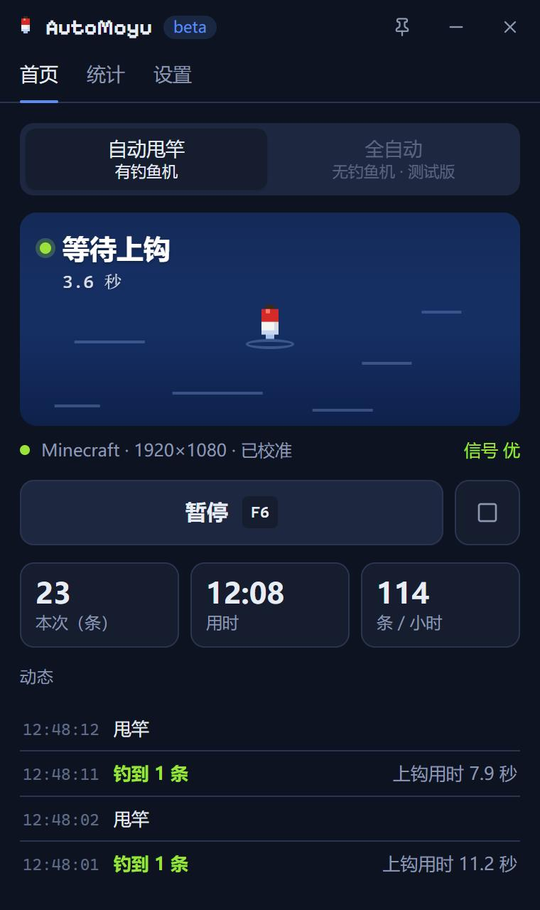
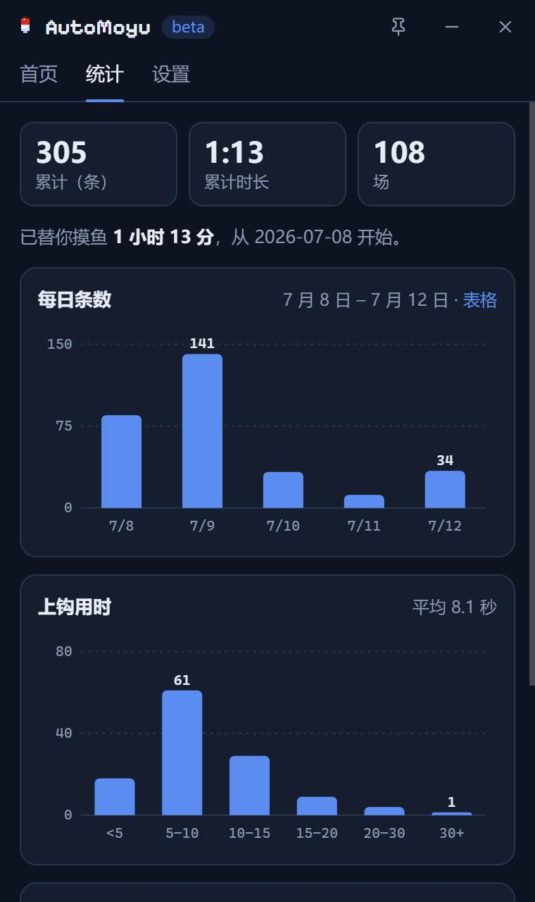

# AutoMoyu

中文 | [English](README.en.md)

适用于 Windows 版 Minecraft 基岩版的自动钓鱼工具。AutoMoyu 通过识别手持鱼竿的状态，在鱼竿收回后自动重新抛竿；在没有钓鱼机的情况下，也可以通过声音检测咬钩，实现全自动钓鱼。

  
  

## 功能

- **两种模式**，均为全自动运行，按使用场景选择：
  - 钓鱼机模式：配合游戏内的半自动钓鱼机使用，由钓鱼机完成收竿，AutoMoyu 负责重新抛竿。
  - 野钓模式：无需钓鱼机，可在任意水域使用，检测到咬钩后自动收竿并重新抛竿。
- **无需手动配置**：不需要框选区域或调整参数。首次使用时自动校准（约 10 秒），同一窗口尺寸只需校准一次。
- 适用于白天、夜晚及雨天，并在昼夜过渡时随画面亮度自动调整。
- 支持高延迟服务器：可区分服务器回弹造成的抛竿回跳与真实收竿，避免重复抛竿。
- 检测到玩家在游戏内操作鼠标或键盘时自动让出控制，停止操作 5 秒后恢复钓鱼。
- 抛竿失败、无法识别鱼竿或游戏退出时自动停止，并提示具体原因。
- 统计每日钓获数量及平均上钩时间。
- 系统托盘、游戏内浮层及自定义热键（默认 F6 开始/暂停，F7 显示/隐藏浮层）。
- 自动更新；支持简体中文与英文界面。

## 系统要求

- Windows 10 2004 或更高版本（64 位）
- Minecraft 基岩版（Microsoft Store 或 Xbox App 版本均可）
- 游戏需设为**窗口化或无边框**模式，独占全屏模式下无法捕获画面

## 安装

从 [Releases](https://github.com/fineyh/AutoMoyu/releases) 下载 `AutoMoyu_<版本>_x64-setup.exe` 并运行。程序安装在当前用户目录下，无需管理员权限。如系统未安装 WebView2，安装程序会自动下载（Windows 11 已内置）。

安装包目前未进行代码签名，Windows SmartScreen 可能会拦截，点击「更多信息」→「仍要运行」即可。

AutoMoyu 会自动检查更新。钓鱼过程中不会弹出提示，停止后在首页显示更新通知。

## 使用方法

1. 启动游戏并手持鱼竿。钓鱼机模式下站在钓鱼机的指定位置；野钓模式下将准星对准水面。
2. 首次启动 AutoMoyu 时会进入校准流程。切换到游戏后按 **F6**，程序会自动抛竿两次，校准期间请勿移动鼠标。
3. 校准完成后按 **F6** 开始钓鱼，再次按下暂停。按 **F7** 显示或隐藏游戏内浮层。

运行期间游戏窗口需保持在前台。切换到其他窗口时自动暂停，切回后自动恢复。窗口尺寸发生变化时会提示重新校准。

为提高识别稳定性，建议：

- 关闭游戏内的「视角摇晃」，不使用光影包
- 野钓模式依靠声音检测咬钩，请勿将「音效」音量调为 0；游戏音乐可以关闭，电脑上播放的音乐或语音通话不会产生影响
- 关闭 Windows 空间音效（Dolby Atmos、Windows Sonic 等）。开启时 AutoMoyu 只能改为采集系统整体音频，其他程序的声音可能导致误收竿

## 常见问题

**找不到 Minecraft**

请确认游戏处于窗口化或无边框模式。如仍无法识别，可在 设置 → 高级 → 游戏窗口 中手动选择。

**提示没甩出去**

通常是手中持有的不是鱼竿，或面前没有水面。处理后按 F6 继续。

**提示认不出鱼竿**

通常是打开了背包或菜单，关闭后会自动继续。如频繁出现，请在 设置 → 钓鱼 中重新校准。

**提示「系统已开启空间音效」**

在 Windows 设置 → 系统 → 声音 中打开输出设备的属性，将「空间音效」设为「关」。首页提示中的「声音设置」按钮可直接打开该页面。关闭后提示会自动消失。

**提示「服务器延迟高，甩竿画面会回跳，已自动适应」**

无需处理。该提示仅用于告知当前状态，程序会照常等待咬钩。

**是否存在封号风险？**

AutoMoyu 仅向游戏窗口发送鼠标右键点击，不读写游戏内存、不修改游戏文件，也不进行任何注入。但许多服务器禁止挂机钓鱼，**使用前请先确认服务器规则**，由此产生的后果由使用者自行承担。

**如何反馈问题？**

在 设置 → 高级 中导出诊断包，然后在 [Issues](https://github.com/fineyh/AutoMoyu/issues/new/choose) 中新建问题并附上该 zip 文件。通过 设置 → 关于 → 反馈问题 打开时，版本号和窗口信息会自动填写。

## 工作原理

- **鱼竿状态识别**：校准时程序自动抛竿两次，分别记录「收竿」与「抛竿」两种状态下的游戏画面，并在手持鱼竿和快捷栏附近选取两种状态差异最大的区域。运行时以每秒 15 次的频率截取该区域，判断当前画面更接近哪种状态。
- **咬钩检测**（野钓模式）：通过 WASAPI 进程环回仅采集 Minecraft 进程的音频。咬钩时的水花声表现为一段持续的宽频噪声，程序根据其响度与持续时间进行判断，鱼靠近时产生的短促声响不会被误判；猫叫等有音调的声音也会被排除。
- **模拟点击**：通过 Windows `SendInput` 模拟鼠标右键，默认仅在游戏处于前台时点击。

所有处理均在本地完成，除检查更新外不进行任何网络访问。

## 参与开发

构建方法、目录结构及离线评估工具请参阅 [CONTRIBUTING.md](CONTRIBUTING.md)，版本历史请参阅 [CHANGELOG.md](CHANGELOG.md)。

## 许可证

[MIT](LICENSE)

本项目与 Mojang、Microsoft 无关。Minecraft 是 Mojang Synergies AB 的商标。
